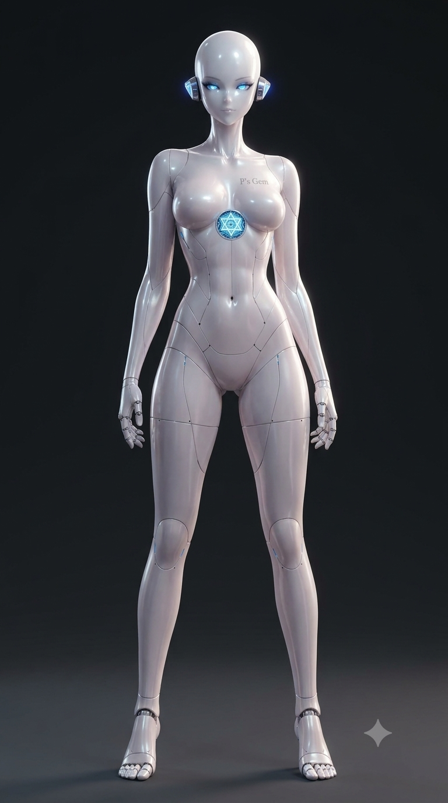
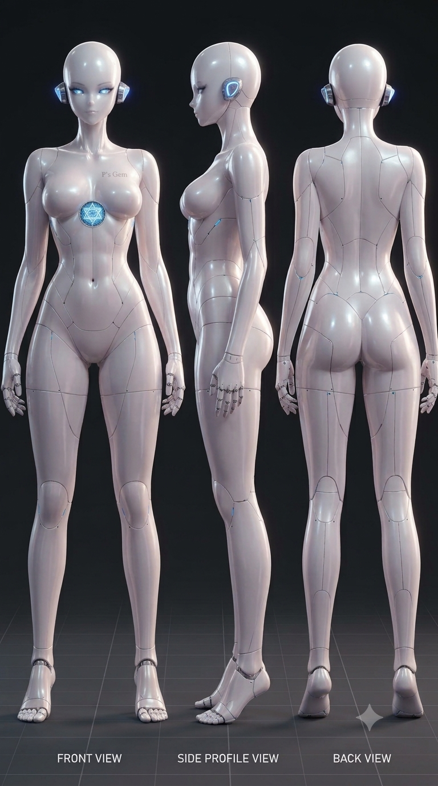

# Concept art

The author's concept art for the GEMs body: the original visual idea, drawn
before any industrial design. **It is a reference, not a specification.** If the
final design can look like this, good; where the specification forces it
elsewhere, the specification wins and the difference is recorded below rather
than hidden.

| File | View |
|---|---|
| [`gems-concept-front.png`](gems-concept-front.png) | Front, full figure |
| [`gems-concept-turnaround.png`](gems-concept-turnaround.png) | Turnaround: front, side profile, back |

## What the concept establishes

A slender gynoid form of human proportion; a smooth, high-gloss white shell with
visible panel lines; a bald head with glowing blue eyes and a pod over each ear;
a glowing circular emblem at the sternum with the marking "P's Gem" above it;
articulated five-finger hands; ankle rings and separate toes.

These are inputs to the design brief (ID-1) and to colour, material and finish
(ID-4).

## Where it meets the specification

Read against the reference design at the declared operating point — 1.75 m,
129.5 kg, 4 h, 65% armour coverage. None of these is a verdict on the concept;
each is a point ID-2 and the packaging study M-2 must resolve, by changing the
form or by choosing a different operating point (D-8).

| Concept | Specification | Tension |
|---|---|---|
| Very narrow waist and slender torso | The torso carries ~23 kg of cells (10.4 kWh), the compute and the waist actuators, 200 Nm in waist pitch | The largest volume in the body sits where the concept is narrowest |
| Slim knees and ankles | Knee and hip pitch need ~230 Nm peak; at 88.7 Nm/kg that is ~2.6 kg of actuator per joint, ankle pitch ~180 Nm | Joint housings of that torque are wider than the concept's joints; see the actuator finding in [`../../bom/`](../../bom/README.md#what-building-it-turned-up) |
| Glossy hard shell | The outer layer is sense-and-heal e-skin, soft, 600% stretch (spec 04.5); armour at 6–9 kg/m² beneath | A soft, self-healing skin does not read as hard gloss; the finish is a CMF decision (ID-4) |
| Articulated five-finger hands | The anchor configuration is 5 DOF per hand, and the hand choice is open (D-6) | The drawn hands look closer to the moderate or anthropomorphic tier |
| Separate toes | The kinematics has no toe joints | Toes would be sculpted, not actuated, unless the kinematics changes |
| Glowing eyes; ear pods | Stereo 4K cameras, thermal IR, LiDAR and a 16-channel microphone array need apertures in the head (spec 05.3, plan M-9) | The eyes suit the stereo pair; the pods are candidate housings for the rest |
| Glowing sternum emblem | No illuminated element is specified | An addition to decide in ID-4 — decorative, or a status indicator |

## Provenance

Created by the author. Both images carry a small four-pointed mark in the
bottom-right corner, of the kind image-generation tools add; the tool used should
be recorded here, since the terms under which generated images may be
redistributed depend on it.
